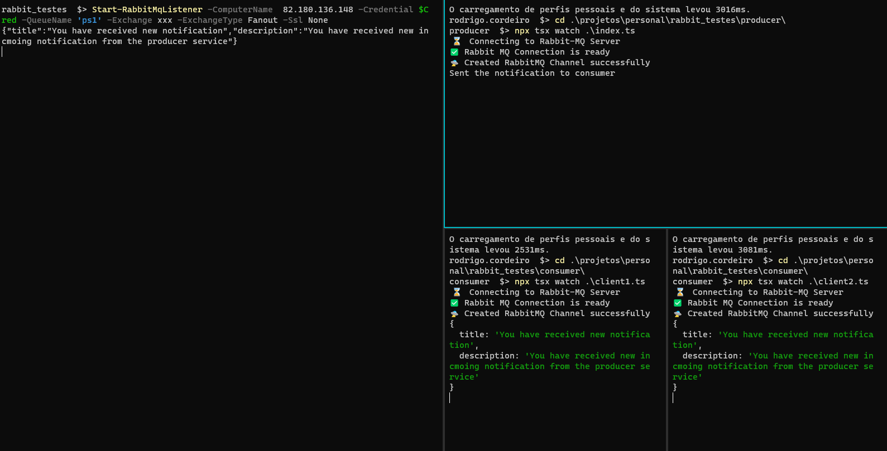

```ps1

    [object] $objCred = $null
    [string] $strUser = 'domain\userID'

    $strPass = ConvertTo-SecureString -String "password" -AsPlainText -Force
    $Cred = New-Object -TypeName System.Management.Automation.PSCredential -ArgumentList ($strUser, $strPass)

    Start-RabbitMqListener -ComputerName  URL -Credential $Cred -QueueName 'ps1' -Exchange xxx -ExchangeType Fanout -Ssl None

    while($true){
        $message = $(Wait-RabbitMqMessage -ComputerName  URL -Timeout 100000 -Credential $Cred -QueueName 'ps1' -Exchange xxx -ExchangeType Direct -Key "ps_notification" -Ssl None | convertfrom-json)
        show-notification -ToastTitle $message.title -ToastText $message.description
    }

```


